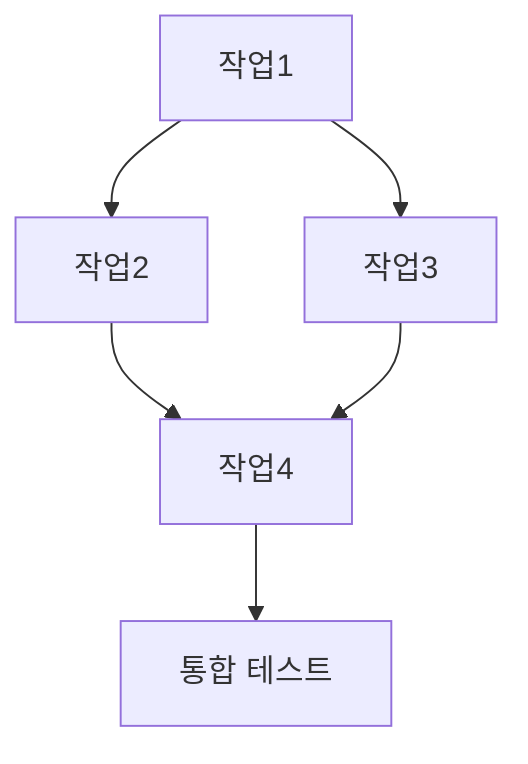
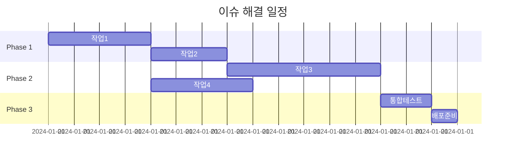

# GitHub 이슈 해결 계획 수립기

GitHub 이슈를 분석하고 해결을 위한 상세한 계획을 수립하는 커스텀 프롬프트입니다.

## 입력된 이슈 번호
**해결할 이슈:** #$ARGUMENT

---

## 1단계: 이슈 정보 수집

GitHub CLI를 사용하여 이슈 정보를 가져옵니다.

```bash
gh issue view $ARGUMENT --json title,body,labels,state,assignees,milestone,comments
```

### 이슈 요약
- **제목**: [이슈 제목]
- **상태**: [Open/Closed]
- **라벨**: [라벨 목록]
- **담당자**: [Assignee 정보]
- **마일스톤**: [해당 마일스톤]

### 이슈 상세 내용
[GitHub에서 가져온 이슈 본문 내용]

### 관련 댓글 및 컨텍스트
[중요한 댓글이나 추가 정보 요약]

---

## 2단계: 이슈 분석 및 이해

### 문제 핵심 파악
- **문제 유형**: [Bug/Feature/Enhancement/Documentation 등]
- **영향 범위**: [어떤 부분에 영향을 미치는지]
- **우선순위**: [Critical/High/Medium/Low]
- **복잡도 예상**: [XS/S/M/L/XL]

### 요구사항 분석
#### 기능적 요구사항
- [ ] 요구사항 1
- [ ] 요구사항 2
- [ ] 요구사항 3

#### 비기능적 요구사항
- [ ] 성능 요구사항
- [ ] 보안 요구사항
- [ ] 호환성 요구사항
- [ ] 사용성 요구사항

### 제약사항 및 고려사항
- **기술적 제약**: [사용 기술, 기존 아키텍처 등]
- **비즈니스 제약**: [일정, 예산, 정책 등]
- **호환성 제약**: [하위 호환성, 브라우저 지원 등]

---

## 3단계: 현재 코드베이스 분석

### 관련 파일 및 컴포넌트 파악
```bash
# 관련 키워드로 코드 검색
grep -r "관련키워드" --include="*.js" --include="*.ts" --include="*.tsx"
```

#### 영향받는 파일들
- **핵심 파일**: [주요 수정 대상 파일들]
- **연관 파일**: [간접적 영향을 받는 파일들]
- **테스트 파일**: [관련 테스트 파일들]

#### 기존 아키텍처 분석
- **현재 구조**: [기존 코드 구조 설명]
- **개선 필요 부분**: [문제점이나 개선점]
- **재사용 가능 컴포넌트**: [활용할 수 있는 기존 컴포넌트]

---

## 4단계: 해결 방안 설계

### 접근 방법 선택
- [ ] **점진적 개선**: 기존 코드를 단계적으로 수정
- [ ] **새로운 구현**: 완전히 새로운 컴포넌트/기능 개발
- [ ] **리팩토링 포함**: 기존 구조 개선과 함께 해결
- [ ] **라이브러리 도입**: 외부 라이브러리 활용

**선택한 방법**: [선택한 접근 방법과 이유]

### 기술적 설계
#### 아키텍처 변경사항
```
[Before]
현재 구조 다이어그램

[After]
변경 후 구조 다이어그램
```

#### 새로운 컴포넌트/모듈
- **컴포넌트명**: [역할과 책임]
- **API 인터페이스**: [입력/출력 정의]
- **의존성**: [필요한 라이브러리나 서비스]

#### 데이터 흐름
```
User Input → Component A → Service B → API C → Database
           ↓
        State Update → UI Re-render
```

---

## 5단계: 상세 구현 계획

### 작업 분해
각 작업은 다음 기준을 만족:
- ⏱️ 2-4시간 내 완료 가능
- 🧪 독립적으로 테스트 가능
- ✅ 명확한 완료 기준 존재
- 🔄 점진적 배포 가능

#### Phase 1: 기반 작업 (필수)
1. **[작업명]**
   - **설명**: [구체적인 작업 내용]
   - **파일**: [수정/생성할 파일들]
   - **완료 기준**: [확인 가능한 기준]
   - **예상 시간**: [X시간]
   - **리스크**: [예상되는 문제점]

2. **[작업명]**
   - **설명**:
   - **파일**:
   - **완료 기준**:
   - **예상 시간**:
   - **리스크**:

#### Phase 2: 핵심 기능 구현
3. **[작업명]**
   - **설명**:
   - **파일**:
   - **완료 기준**:
   - **예상 시간**:
   - **리스크**:

#### Phase 3: 통합 및 최적화
4. **[작업명]**
   - **설명**:
   - **파일**:
   - **완료 기준**:
   - **예상 시간**:
   - **리스크**:

### 의존성 및 순서


### 병렬 처리 가능 작업
- **동시 진행 가능**: [독립적인 작업들]
- **순차 진행 필요**: [의존성이 있는 작업들]

---

## 6단계: 테스트 전략

### 테스트 계획
#### 단위 테스트
- **대상**: [테스트할 함수/컴포넌트]
- **시나리오**: [테스트 케이스들]
- **도구**: [Jest, React Testing Library 등]

#### 통합 테스트
- **대상**: [통합 테스트 범위]
- **시나리오**: [사용자 시나리오 기반 테스트]
- **도구**: [Cypress, Playwright 등]

#### 수동 테스트
- **체크리스트**:
  - [ ] 기능 동작 확인
  - [ ] UI/UX 검증
  - [ ] 반응형 디자인 테스트
  - [ ] 접근성 테스트
  - [ ] 성능 테스트

### 품질 게이트
- **코드 커버리지**: 최소 80% 이상
- **Lint 검사**: 모든 경고 해결
- **Type 검사**: TypeScript 에러 0개
- **성능 기준**: [구체적인 성능 목표]

---

## 7단계: 리스크 관리

### 예상 리스크 및 대응 방안
#### 기술적 리스크
- **리스크**: [예상되는 기술적 문제]
- **영향도**: [High/Medium/Low]
- **대응 방안**: [문제 발생 시 해결책]
- **예방 조치**: [사전 예방 방법]

#### 일정 리스크
- **리스크**: [일정 지연 가능성]
- **영향도**: [High/Medium/Low]
- **대응 방안**: [일정 단축 방법]
- **예방 조치**: [버퍼 시간 확보 등]

#### 품질 리스크
- **리스크**: [품질 저하 요소]
- **영향도**: [High/Medium/Low]
- **대응 방안**: [품질 보장 방법]
- **예방 조치**: [코드 리뷰, 테스트 강화 등]

### 롤백 계획
- **롤백 조건**: [어떤 상황에서 롤백할지]
- **롤백 절차**: [단계별 롤백 방법]
- **데이터 백업**: [필요한 백업 계획]

---

## 8단계: 구현 일정

### 예상 일정표


### 체크포인트
- **25% 완료**: Phase 1 완료 시점
- **50% 완료**: Phase 2 완료 시점
- **75% 완료**: Phase 3 완료 시점
- **100% 완료**: 모든 테스트 통과 및 배포 완료

---

## 9단계: 사용자 검증 요청

### 📋 계획 요약
이슈 #$ARGUMENT 해결을 위한 계획을 수립했습니다.

**예상 소요 시간**: [총 예상 시간]
**주요 변경사항**: [핵심 변경 내용 요약]
**리스크 레벨**: [전체적인 리스크 평가]

### ✅ 승인 체크리스트
다음 항목들을 확인해 주세요:

- [ ] **접근 방법이 적절한가?**
  - 선택한 해결 방식이 이슈의 요구사항과 부합하는가?
  - 기존 아키텍처와 잘 어울리는가?

- [ ] **작업 범위가 적절한가?**
  - 과도하게 복잡하거나 단순하지 않은가?
  - 일정이 현실적인가?

- [ ] **리스크 관리가 충분한가?**
  - 주요 리스크들이 식별되었는가?
  - 대응 방안이 적절한가?

- [ ] **테스트 계획이 충분한가?**
  - 품질을 보장할 수 있는 테스트 전략인가?
  - 회귀 테스트 고려가 되어있는가?

### 🤔 검토 질문
1. **우선순위**: 이 계획에서 가장 중요하다고 생각하는 부분은?
2. **우려사항**: 가장 걱정되는 리스크나 문제점은?
3. **대안**: 다른 접근 방법을 고려해볼 필요가 있는가?
4. **일정**: 제안된 일정이 현실적인가?

### 🚀 다음 단계
승인 후 진행할 작업:
1. **즉시 시작 가능한 첫 번째 작업**: [Phase 1의 첫 번째 작업]
2. **필요한 준비사항**: [시작 전 준비해야 할 것들]
3. **첫 번째 체크포인트**: [언제 첫 번째 리뷰를 할지]

---

**👍 승인하시겠습니까?**
- **Yes**: 계획대로 구현을 시작합니다
- **No**: 수정이 필요한 부분을 알려주세요
- **Partial**: 일부 수정 후 재검토가 필요합니다

이 계획을 기반으로 체계적이고 안전하게 이슈를 해결하겠습니다.